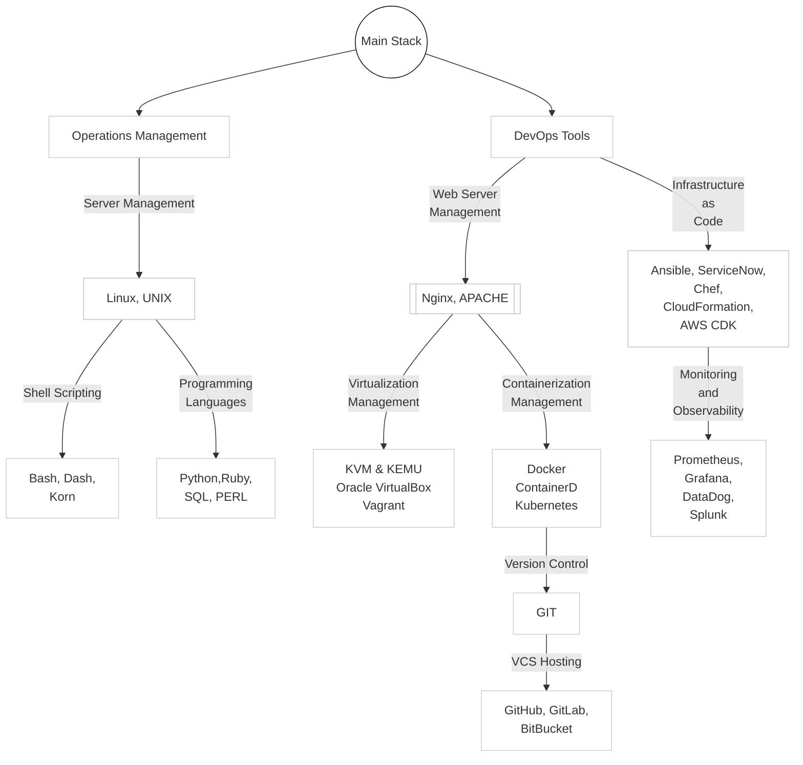
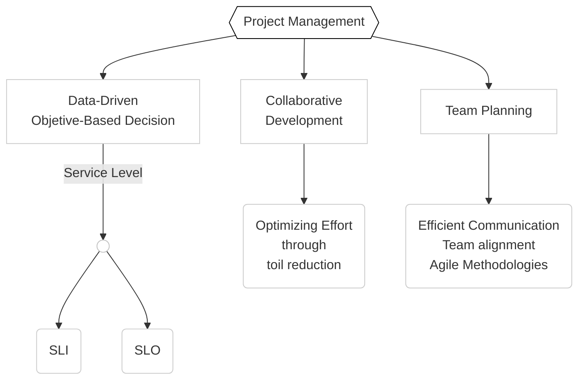
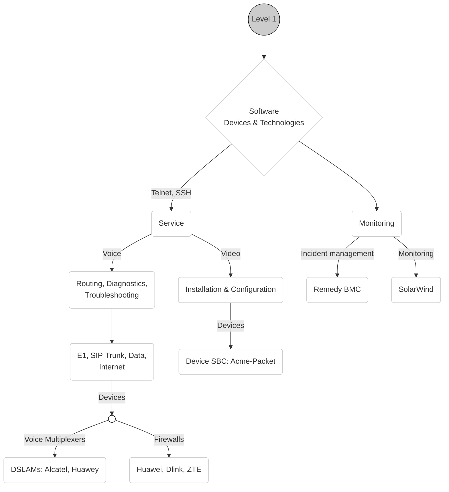
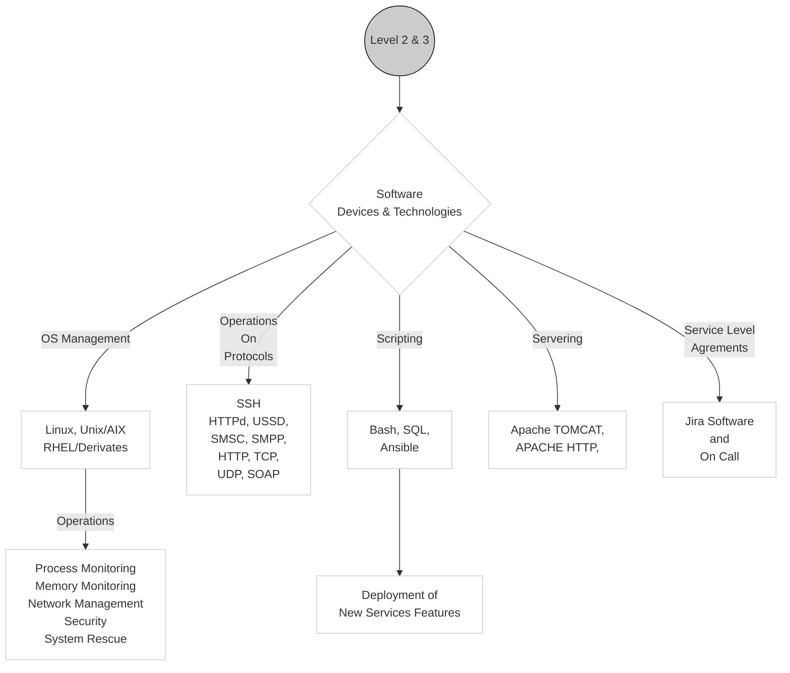
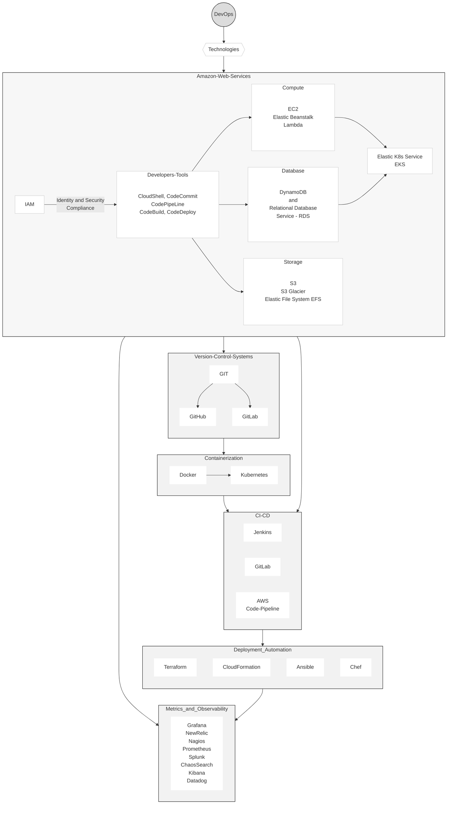
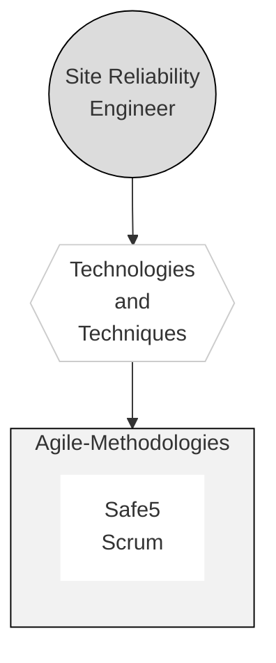
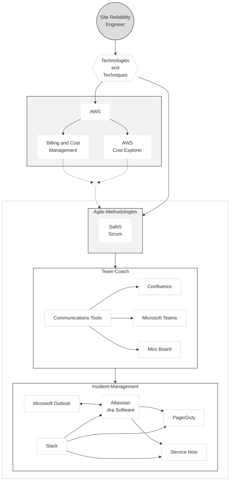

# Professional Profile

Kevin J. Figueroa M
<ol>
    <li><b>Career</b>: Telecommunications Engineer
    </li>
    <li>
    <b>Roles in the industry</b>:
    <ol>
        <li>Site Reliability Engineer Manager</li>
        <li>Site Reliability Engineer</li>
        <li>DevOps Engineer</li>
        <li>Support Engineer</li>
    </ul>
    </li>
</ol>

## Profile Points of interest:
* I have experiences working with **large-scale distributed systems**
* I have provided consulting, deployment and maintenance of software in **On-Legacy architectures**, supporting large projects and services in **digital transactions** for **mobile technologies**.

## Skills

## Technical Skill-Set as Support Engineer

## Skill-Set as DevOps

## Skill-Set as Site Reliability Engineer

### Site Reliability Engineering Manager

I take on big challenges and have a strong ability to deliver solutions that thrive in complex environments. I am attracted to innovation, my vision is to focus on discipline, consistency and technique to achieve my goals and objectives as close as possible to the results I expect.

Responsible for leading the adoption of agile methodologies to
develop a mindset of success and continuous improvement in my
division's DevOps teams, fostering self-sufficiency and diverse group
agility competencies.

Ensure the methodological application of “The twelve-factor app” in
web and mobile applications, seeking to offer maximum portability in
execution environments, in addition to standardizing the mechanisms
for recording and reporting accuracy on these services and resources
in the cloud.

Delegate tasks to members of the engineering team (eight people) and
advise on all aspects of the project.
Collaborate in the development of plans and roadmaps for new
production releases, manage configurations and service recovery by
applying the different methods of deployment and continuous
delivery.

Ensure SLO prevalence, KPI scoring, manage Application error control,
as well as system alerting and monitoring solutions, organize incident
response and disaster recovery monitoring/collaboration.
Apply various collaborative tools for information flow (Development
Workflow, Asynchronous Collaboration, Process Mapping and
Diagramming), collaborate with the development of plans and
tracking of project cycles using agile methodologies implemented in:
Miro Board, Atlassian's Confluence and Microsoft Teams.

Oversee costs and budgets for each project and service deployed in
the Amazon cloud.
